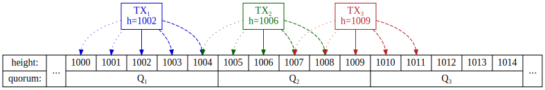
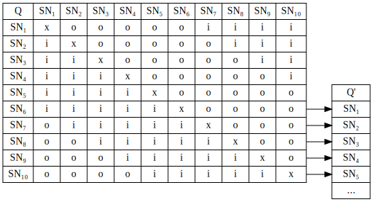
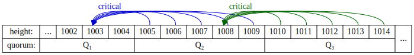

# Loki Blink Design

## Metadata

**LIP Number**: LIP-4

**Title**: Loki Blink \[No Vote\]

**Author**: Jason Rhinelander (@jagerman) <jason@loki.network>

**Status**: Draft

**Type**: Core

**Created**: 2019-06-06

**Requires**: LIP-3 (checkpointing)

**Source**: [LIP 4](https://github.com/loki-project/loki-improvement-proposals/blob/master/LIPS/LIP-4.md)

## Version history
  - *v0.9*
      - Initial public draft.

## 1. Summary

Blink is Loki’s instant payment mechanism proposed in the original Loki whitepaper. Once completed, Blink will allow users to send payments instantly to each other and allow instantly resend of received Blink transactions without requiring blockchain confirmations.

This document is intended to serve as a whitepaper underlying the concrete design for the implementation of Loki Blink with an expectation of inclusion in the 5.0.0 release.

## 2. Abstract

Blink takes advantage of Loki’s [service node](../ServiceNodes/SNOverview.md) layer and [checkpointing mechanism](https://github.com/loki-project/loki-improvement-proposals/blob/master/LIPS/LIP-3.md) to provide a strong assurance that a transaction will eventually reach the blockchain without risk of various adversarial attacks cancelling the transaction. It does this by using multiple quorums to validate a transfer and block conflicting transfers. This validation in combination with checkpointing and updated blockchain consensus rules help ensure that such validated transfers have a strong assurance of reaching the transaction memory pool and thus can be relied upon without requiring mining confirmations.

## 3. Blink from the user perspective

### 3.1. Wallet side

From the user (wallet) side, initiating a Blink transfer is nearly
identical to initiating a normal transfer, but with an extra flag
(e.g. GUI checkbox, RPC parameter, CLI option) to say “Blink this
transaction\!”.

The fees of the blink transaction are higher as it involves considerably
more work for the network: service nodes must validate the transaction,
and all nodes must perform extra validation steps and require some
temporary extra storage to store recent Blink transaction details.

For the user receiving a blink transaction, the wallet will see the
received amount virtually instantly (that is, as soon as it is received
by the lokid and the wallet refreshes with the daemon). Moreover these
funds will be instantly spendable: unlike a regular transaction there
will be no lock on the received funds before they can be spent again.
The wallet user can immediately re-Blink the funds to someone else, or
can send off a regular (non-Blink) transaction that spends the received
Blink outputs instantly without needing to wait for the Blink
transaction to be mined into a block.

### 3.2. Re-blinking

One of the goals of Blink is the ability to “re-Blink”: That is, we want
a Blink transaction to be instantly available to the recipient
indistinguishable from a (confirmed) non-Blink transaction from a
usability perspective. For example, when Ava blinks 10 LOKI to Betty
then that transaction is initially still in the mempool, but we don’t
want Betty to have to worry about this technical detail: instead Betty
can instantly Blink it to someone else, send a regular transaction, or
use it to stake a new service node without waiting for even a single
confirmation.

### 3.3. Fees

The precise fee schedule is yet to be determined, but will be an
additional amount on top of the current transaction fee, most likely
calculated as a multiple of the transaction fee. Additionally, Blink
transactions will not have a choice in transaction priority: since they
are instantly spendable and guaranteed by the network, there would be
little point in a user ever choosing anything higher than the minimum.
Thus, for now, we mandate that Blink fees must always be submitted with
a “normal” priority transaction fee (but this is tentative and may be
adjust this before final Blink release).

The extra Blink fee doesn’t go to anyone: rather it gets permanently
destroyed as part of the transaction. We considered two alternatives
here:

1.  Collecting fees and redistributing to SN over time. This would
    involve temporarily burning Blink fees, but keeping track of how
    much had been burned and continually reemitting them over a period
    of time as an extra rewards to Service Nodes. (For example: in every
    block, reduce the current pool of burned fees by 0.1% and reemit it
    to the service nodes that earn a reward in that block).
2.  Just burning fees.

Ultimately we decided on the second approach because:

  - It is much simpler.
  - It is more predictable: SN rewards (for a stable number of service
    nodes) are known precisely.
  - In the end, the two approaches are effectively equivalent in terms
    of total emission.

By equivalent I am assuming that we have a specific net emission target.
For simplicity, I’ll just talk about the long-term 28 LOKI/block
emissions, and, for the sake of example, assume that it is divided up so
that service nodes get 20 LOKI/block of that;[\[1\]](#footnotes) the remaining 8 is
foundation and miner coinbase rewards. What I mean by net emission is
that if we have an average burning of 5 LOKI/block in Blink fees, then
the net emission would 23 LOKI/block. But let’s suppose that 25
LOKI/block is our actual desired long-run emission target.

With method 1, we’re emitting 28 LOKI/block: burned Blink fees are
reemitted over time and so, much like regular tx fees, there is no net
gain or loss. To hit the 25 LOKI/block target we’d have to adjust the
formula to reduce emissions to 25 LOKI/block.

With method 2, where we are burning 5 LOKI/block in fees, we are
generate net emissions of 23 LOKI/block; to hit the same 25 LOKI/block
target, then, we would need to *increase* coinbase emissions by 2
LOKI/block to hit our target.

Either way we arrive at the same place: net emissions of 25 LOKI/block
through adjustment of the emission schedule. This was just an example,
of course; our actual target could be 20 or 28 or 12 or whatever else.
But with method 2, service nodes always know exactly what they will
earn, while with method 1 there is more variability: large, sustained
differences in the volume of Blink transactions will affect SN
profitability, while in method 2 such differences will affect the
overall coin emission but *not* the amount earned by a service node.

Thus, given the simpler approach and essential equivalence between the
two approaches, we decided to pursue method 2. (Of course, like anything
in Loki, we can always change the design later given compelling reasons
to do so\!)

## 4. Technical design

### 4.1. Transaction overview

In a nutshell (with most of the details covered later in this document):
The wallet builds a transaction and sends it to the lokid to be blinked.
The lokid then looks up the Blink quorum, connects to a few nodes in
this quorum, sending the transaction to them to be signed. The quorum
distributes the transaction within itself, and once enough approval
signatures are collected, broadcasts the transaction and signature data
to the service node’s p2p peers to disseminate it across the network.
The lokid talking to the quorum then receives a confirmation message
(with signatures) to relay to the wallet.

These steps are depicted in Figure 1. Note that the diagram has been
significantly simplified for illustration to show only three service
nodes per quorum rather than the actual ten.

In more detail:

1.  The wallet constructs a transaction. This transaction is *almost*
    like a regular transaction except that it leaves enough inputs
    unspent to cover both the required mining transaction fee and the
    Blink fee. This transaction gets send to the wallet’s lokid for
    handling.

2.  lokid looks at the transaction, does some preliminary checks (as it
    would with any transaction) and additional checks related to the
    Blink transaction (such as having the correct transaction priority
    and blink fee). These checks are not strictly required for network
    security—they will also be done by the service nodes — but can give an
    immediate failure response to the wallet if the node reasonably
    believes the transaction will fail. Assuming the preliminary checks
    pass, the node then uses the current blockchain height to determine
    the transaction’s signing height, *h*. This *h* value then
    determines two current Blink quorums, *Q* and *Q’* (more details on
    quorum construction are in the [Quorum selection](#42-quorum-selection)
    section below). The lokid handling the transaction connects directly
    to 2 nodes selected randomly from each quorum and sends the
    transaction (plus other required details such as *h*) to be signed.

3.  The receiving quorum nodes directly contacted by the initiating
    lokid forward the transaction details to the other quorum nodes for
    verification.

4.  Each service node in the two quorums performs checks on the validity
    of the transaction, such as ensuring that it isn’t already spent,
    that it isn’t already in the mempool, that miner and Blink fees are
    correctly specified, and that the requested signature height, *h*,
    *h* is approximately current (within 2 blocks of what the service
    node believes is the current height), and that the key images have
    not been already locked out by a previous, different Blink
    transaction signing. Assuming everything checks out, the service
    node records the transaction’s key images locally (to lock them out
    from being signed again by this service node), signs the transaction
    hash with the service node private key, and sends the signature to
    the other quorum members.

5.  As each of the quorum members receives a supermajority of valid
    signatures (i.e. 7 in total) from *both* quorums it immediately
    sends out the transaction and signature details to its blockchain
    peers via its p2p network. If the quorum node in question is one of
    the nodes that was directly contacted by lokid, it additionally
    communicates the success back to the caller.
    
    These signed mempool transactions, however, are much stronger than a
    regular mempool transaction in that they can trigger a reorg or lead
    to rejected blocks: more details on this are covered below.
    
    In the case of detectable failure (for example, from a detected
    double-spend confirmed by a sufficient number of service nodes), a
    failure message is returned to the caller. If a failure is caused by
    too many quorum nodes timing out the caller is expected to itself
    timeout after an appropriate amount of time waiting for a response.

6.  The initiating lokid waits for success, failure, or timeout from the
    quorum nodes it contacted, and once received (or timed out), sends
    this information back to the wallet.

### 4.2. Quorum selection

Quorum selection works by using the requested signing height *h* to
deterministically select the two relevant quorums, *Q* and *Q’*. A
quorum *Q* is determined by the 5-block range within which *h* falls,
and *Q’* is the quorum for the immediately subsequent 5-block range. For
example, any *h* value in 1000–1004 will yield the same *Q* and *Q’*
quorums, and this *Q’* will be exactly the same quorum as the *Q* quorum
for an *h* value in the 1005–1009 signing height range. In other words,
*Q’(h=1003)* and *Q(h=1006)* are the **same quorum**.

All service nodes in *Q* and *Q’* refuse to sign a transaction with a
requested signing height *h* that is more than 2 blocks behind or ahead
of the service node’s current blockchain height: this is to allow some
tolerance for Blink transactions to succeed even if new blocks are
propagating through the network during the Blink transaction signing
process. This ±2 tolerance is designed to make the user experience
better: using a node that is slightly out of sync[\[2\]](#footnotes) will still work
fine rather than returning a Blink failure. It also avoids potential
Blink failures on the part of quorum nodes: if a block happens to arrive
during the actual signing process such that half of the quorum see the
new block and half see the old block the quorum will still sign without
issue. On the other hand the ±2 limit on the signing height also
prevents abuse: the larger the allowed range, the more choices a
malicious actor would have to pick and choose a “friendly” quorum.

The quorum sample itself needs to be effectively immutable, and so we
propose a deterministic random sampling using a MT19937-64 random number
generator seeded with the block hash 35 blocks before the first valid
quorum height, *h₀*. Thus quorum *Q* for height 1002 is determined by
block 965 (35 blocks before the first signing height of the quorum,
*h₀*=1000), and quorum *Q’* is determined by block 970 (35 blocks
before the first height of the second quorum, *h’₀*=1005). Moreover the
sampling algorithm excludes any service nodes that are scheduled to
expire before block *h₀*+10.

For validation of a Blink transaction we require a supermajority of
signatures from *both* quorums. The point here of using the two quorums
is to prevent a timing conflict where, if we had just one quorum per
block (or range of blocks), then one Blink transaction could be signed
by quorum *Q₁* and another transaction spending the same keys could be
signed by quorum *Q₂* **before** the first transaction is broadcast to
the network. By using two overlapping quorums we end up with the key
images in question being locked both in the current quorum but also in
the following quorum (which could come as early as the next block). Even
if the next Blink transaction switches to a new quorum, the overlap
ensures that it simply switching to a quorum that has already locked any
key images of Blink transactions submitted in the last few blocks.

#### 4.2.1. Overlapping quorums rationale

There are three reasons for using these two overlapping quorums. First,
we want the quorum signature process to “reach” a few blocks into the
future (5–9 blocks ahead with 5-block quorums) to give enough time for
the quorum signatures to disseminate across the network. While 5 blocks
is more than would be typically required, there are some edge cases
discussed in detail below that can lower this future block interval to
just 2 blocks.

Second, Blink processing is expected to require a substantial number of
connections between service nodes; with 5-block quorums we can at least
reduce the frequency with which connections need to be established as
service nodes will keep their connections open for the duration of the
quorum.

Third, using two quorums offers considerable higher security than one
quorum of twice the size for two reasons. First, each quorum is
essentially a new random draw of service nodes; that means the more
quorums you have over a given period of time the more random draws you
do, and with more draws you get more “chances” to pick a compromised
sample. Second, two *consecutive* supermajorities of quorums of half the
size is considerably more secure than one supermajority of a quorum
twice the size.

Some numbers can help demonstrate this: suppose the network has 1000
service nodes, and a single malicious actor is in control of 25% of
those service nodes. Under alternative A, we require the majority of a
single quorum of 20 service nodes, and require a 70% of the service
nodes’ signatures. Under alternative B, we require two quorums of 10
service nodes each, again requiring 70% signatures from each quorum.

Under scenario A in any given quorum the actor has a probability of
0.00000381 of having the required 70% majority. Under scenario B, the
actor has a probability of 0.000000173: that is, under scenario A, the
actor is about 22 times more likely to obtain control of any random
quorum than any random quorum pair. Or to put it into context: in a one
year span, there’s about an 18% chance that this bad actor would gain
quorum control for at least a single quorum under scenario A, and about
a 0.9% chance that he would under scenario B. As for quorum length, if
quorums lasted for one block instead of five there would be a 4.4%
chance of this 25% operator having a quorum supermajority at least once
under the overlapping quorum design, and a 63% chance under the single
quorum design.

If this adversary actually controlled an incredible 50% of the service
node network it would be quite difficult to avoid a compromise: he would
have quorum supermajority votes about 2% of the time under the single
quorum approach, and 0.3% of the time under the overlapping quorum
approach. Such an adversary would have a 95% chance of quorum ownership
at least once *per day* with a quorum of 20, and a 35% chance per day
with overlapping quorums.

It is worth pointing out, in passing, that these probabilities are
countered by the economic design of Loki: even if such adversaries
existed, they would have a strong financial incentive to ensure that the
network is not compromised as such a compromise would likely have a
significant negative impact on their own holdings, which are heavily
invested and locked into service node stakes.

There is, of course, some desirable statistical properties of making a
quorum *longer*: if quorums changed on a 10 block cycle you’d cut the
probability of compromise by nearly half (to 0.45% in the overlapping
case). This gain isn’t huge, though; moreover the longer the quorum
becomes the more complications can arise from service node
deregistrations, and the more time you allow for coordination between
service node operators looking to cheat the system.

Instead, if we wanted to further increase the security of Blink
transactions, a preferable approach would be to use a triple quorum. It
could also be possible to enable an opt-in triple quorum, at a higher
fee, to allow users to send with a paranoid level of assurance. (This is
now, however, part of the current Blink plan.)

#### 4.2.2. Quorum selection block and checkpointing rationale

Using a lag of 30 blocks for quorum determination was chosen to interact
with Loki checkpointing. Unlike checkpointing and deregistration
quorums, a change in Blink quorums would be highly undesirable as the
validity of the Blink signature would no longer hold. Thus we want to
use a height from the blockchain that is sufficiently far back as to be
highly likely to be made immutable via checkpointing. By basing the
quorum on *h₀*-30 we give ample time for checkpointing even if 2-3
checkpoints have been missed.

For example, if blinking at height 1000 then *Q’* begins at 1005, which
means the relevant block for determination of *Q’* is 975. Checkpointing
normally occurs every 4 blocks with immutability occurring after 3
checkpoints. Thus in typical times it can be up to 4 blocks since the
last checkpoint quorum, which itself establishes a checkpoint on a block
4 blocks earlier. Allowing up to 2 blocks for the quorum to vote and
disseminate the checkpoint to the network this means the first
checkpoint is usually between 4 and 10 blocks ago, the second is 8-14
blocks ago, and the third, immutable checkpoint is 12-18 blocks ago. If
one of these checkpoints were missed (for example because of a quorum
failure) then the immutable checkpoint could be 16-22 blocks ago; and if
three were missed, up to 30 blocks ago. Thus the *h₀*-35 rule
establishes that both quorum selections are established by a block at
least 30 blocks in the past, which allows Blink to tolerate up to 3
missing checkpoints.

To further secure Blink transactions we further require that the quorum
seed heights are checkpoint-immutable: both the initiating lokid and the
quorum service nodes will verify that the quorum seed height is in fact
checkpointed, refusing to sign (and thus failing the Blink if enough
fail to see the required checkpoints) if it is not. This ensures that
Blink transactions are secure by preferring to fail a Blink signature
rather than include one that has any chance of being invalidated by a
block reorganization.

### 4.3. Quorum validation

Some potential cases are depicted below:

#### 4.3.1. TX example one

*TX₁* is depicting a transaction submitted to a daemon which sees the
current height of the network at 1002. 

We can think about a few different cases:

  - Submitting the blink transaction normally at the known height
    (1002). Thus we get *Q = Q₁* and *Q’ = Q₂* for the two quorums. The
    initiating lokid contacts a random service node *q* from *Q₁*,
    passes along the transaction, and waits for a reply from *q*. *q* in
    turn communicates with its quorum peers and the subsequent quorum
    (*Q₂*) to build the required set of signatures. Once the required
    signatures are accumulated the transaction is released by the quorum
    service nodes to their peers.
    
    The Blink TX is broadcast to the network. Because a majority of *Q₂*
    service nodes signed it and will not resign the same key images, the
    earliest possible Blink height to spend the same key images is 1010,
    which can be used by a cheating lokid at network block 1008 at the
    earliest.

  - Submitting slightly behind the network (1000 or 1001). This could
    happen, for instance, because there have been two recent blocks that
    the local lokid has not synchronized yet. Generally everything here
    works as above: the service nodes at height 1002 will still sign the
    block (assuming the transaction itself is valid) because the
    requested signature height is within 2 of their current height.

  - Submitting slightly ahead of the network (1003 or 1004). This could
    happen, for instance, if the local node is close to a very lucky
    pool that has just discovered a couple blocks that haven’t
    disseminated across the network yet. Again, this is handled just
    like the above: even though the service nodes haven’t yet seen a
    block newer than 1002 it still satisfies the within-2 rule and so
    they will still sign (assuming the transaction is valid).

  - Submitting well behind or well ahead of the network (999 or lower,
    or 1005 or higher). In this case the quorum will not accumulate
    enough signatures because the within-2 requirement is violated. In
    this case a failure gets returned to the initiating lokid.[\[3\]](#footnotes)

The first three (accepted) cases above all result in the earliest block
a cheater could submit to being 1008 (i.e. abusing the within-2 rule to
submit a h=1010 block), giving a worst case of at least 4 blocks needing
to be transmitted to the network before a duplicate Blink could be
submitted; since Blink dissemination is high-priority this should result
in a high level of assuredness that a Blink double-spend cannot be
performed in this scenario.

#### 4.3.2. TX example two

*TX₂* in Figure 2 shows a transaction that is sent via a lokid that sees
the current *h=1006*, i.e. in the second block of quorum *Q₂*. I’ll just
ignore the *h\>1008* and *h\<1004* cases (see above for why they are
dead ends).

  - Case 1: Submitting *h*=1005, 1006, 1007, 1008. This case is largely
    the same as *TX₁*, but now the two quorums are *Q₂* and *Q₃*. The
    earlier a theoretical double-spending Blink could be submitted is
    with *h*=1015 at actual height 1013: that is, a minimum of 5 network
    blocks away.

  - Case 2: Submitting *h*=1004 (either due to a lagging node, or a
    malicious actor). This ends up using the same quorums as *TX₁* (that
    is, *Q₁* and *Q₂*). As in *TX₁*, the earliest possible double spend
    could be submitted at 1008.

Case 2 here represents the worst possible scenario: there are just two
network blocks between the current height (1006) and the height at which
a blink transaction could be submitted to a completely independent
quorum pair. There is a potential issue here from an attacker, discussed
in further detail below.

#### 4.3.3. TX example three

*TX₃* is included for completeness to show that cheating *ahead* by a
quorum has no advantage for a potential attacker. This depicts the
sending transaction at *h*=1009. The attack essentially has two relevant
choices: *h*=1007–1009, or *h*=1010,1011. In the first case, he gets
quorums *Q₂* and *Q₃*, making his earlier possible Blink double-spend at
*h*=1015 (submitted at *h*=1013), which is

>Stats geek note: the probability of being 3+ blocks behind the network
>with lag *L* seconds is the CDF value of a Poisson distribution with
>λ=*L*/120 at *k*=3.

### 4.4. Repeated signing of the same transaction

One possible Blink failure mode is that the requested signature height,
*h*, is seen as too old (or even too new) by some or all members of the
service node quorum if it does not fit within their ±2 tolerance. This
could be caused, for example, by the lokid the wallet is talking to
being out of sync. In the case of such a failure, the calling lokid
could check for new blocks and, if changed, resubmit the transaction for
signing at an updated signing height *h*. We want this resubmission to
succeed even if it goes to the same quorum, as it makes the Blink
process more robust to network synchronization issues.

This means, in particular, that service nodes will need to add an
exception to the normal key image blacklisting if asked to re-sign the
exact same transaction for which the key images were
blacklisted.

### 4.5. Signature failure: key images may stay unblinkable (for up to 10 blocks).

When a service node signs a transaction as part of a given quorum it
will never sign a different transaction containing any of the same key
images again as part of that quorum. Since failures are possible for
multiple reasons, however, it does not block the key images of a
transaction that it refused to sign.

It is possible, however, for a transaction to fail to be signed by a
supermajority while still being signed by a superminority (that is, by
enough other nodes to prevent a supermajority). This case is expected to
be rare: the criteria for service node disagreement is small:
effectively you would need (roughly) half of the service nodes to see
something wrong with the transaction. It is not impossible, however: if
a regular transaction spending the same key images is mined and the
block transmitted in the middle of signing the blink could fail.

The user-facing problem that could arise here is that the transaction
that gets signed includes multiple key images, only some of which are
ineligible. The service nodes that signed the transaction, however, end
up locking *all* of the key images for the duration of the quorum (
i.e. the next 4–9 blocks), so even once the user wallet sees the
updated chain a new transaction *might* end up trying to blink using an
input that is temporarily non-blinkable (note that it *will* still be
regularly minable since the Blink was not transmitted due to the quorum
failure).

This case seems rare: it would require a legitimate user spending
regular transactions and blinking at the same time from different
wallets. It’s possible, of course, but given the rarity and the
relatively minor consequence (not being able to Blink those outputs for
10–20 minutes) for now we will simple leave this as a known limitation.

### 4.6. Blink transactions entering the mempool

Blink transactions themselves are perfectly ordinary transactions on the
blockchain: the signatures applied by service nodes do *not* end up as
part of the transaction that gets mined into the chain. Instead this
metadata is shared and synchronized between nodes from the time when a
Blink transaction enters the mempool until the transaction is mined
*and* secured behind an immutable Loki checkpoint boundary.

An incoming Blink transaction in the mempool will also be transmitted
with the Blink height and the verifiable Blink signatures at which the
transaction was signed. Based on this, a loki node receiving a blink
transaction will perform multiple actions:

  - Verify that the Blink signatures are the correct signers for the
    given height, and that the signatures are valid (and if not reject
    the Blink transaction).
  - Check to see if any of the key images were spent in or before the
    last irreversible checkpoint block: if so, reject the Blink
    transaction.
  - Check to see if the mempool already contains any Blink transactions
    that have a higher priority (i.e. lower height) than the incoming
    transactions, and if so, refuse the incoming transactions. (This
    shouldn’t be possible, but is included as a safeguard to maintain
    consensus).
  - Check the current chain back to the last irreversible checkpoint: if
    any blocks contain any transactions that spend any of the key images
    in the new Blink transaction then roll back the chain as much as
    needed to remove those transactions from the blockchain, re-adding
    any rolled back transactions into the mempool (as occurs already
    with any reorg).
  - Reject any non-Blink transaction from the mempool that spend the
    same key images as the new Blink transaction (if we just rolled back
    then this means immediately rejecting the conflicting transactions).
  - Reject any *Blink* transactions from the mempool that spend the same
    key images but have a lower priority (i.e. higher height) than the
    new Blink transaction. This should not be possible in general, but
    needs to be specified anyway to avoid a consensus failure (as with
    the mirrored check above). Note that this actual removal could
    cascade if there are other transactions referencing the removed
    Blink transaction.

Another difference with Blink transactions is that they should not be
subject to the existing 2-week mempool transaction timeout. We don’t
want someone to be able to submit a low-priority Blink transaction while
the network is flooded with higher priority transactions and be able to
wait out the transaction until timeout. As long as Blink transactions
stay in the mempool until mined all an attacker can do is delay the
transaction from being mined, but cannot cause it to be dropped no
matter how long he prevents mining. In the unlikely event of a bug that
makes a Blink transaction inadmissible to the blockchain for some
unforeseen reason, this approach will keep the transaction alive
indefinitely until the bug can be addressed.[\[4\]](#footnotes)

Second, Blink transactions need to be more actively propagated across
the network than current transactions. Currently the mempool is not
actively synchronized across nodes; instead new transactions are simply
broadcast to all connected peers when received. A new node, a node that
was temporarily down when the transaction propagated across the network,
or a node that has had its mempool manually flushed does not receive
existing mempool transactions from peers if it misses it the first time.
This needs to change for Blink transactions: when a p2p connection is
established we need each peer to send the other a list of any pending
Blink transaction details it doesn’t already have. Effectively we need
Blink transactions in the mempool to become first-class synchronization
objects, just like blocks.

Finally, synchronized Blink transactions may not be (and do not need to
be) identical across the network in terms of attached quorum signatures:
it is entirely possible for two nodes to receive a *different* set of 14
signatures: so long as all are valid for the quorum

### 4.7. Blink transactions entering the blockchain

A transaction entering the blockchain from the mempool requires two
changes: first, the Blink transaction’s unspent amount now includes both
the tx fee, as before, but now *also* the Blink fee. Second, because
transactions can reference other Blink transactions currently in the
mempool this puts an ordering on transactions: if A includes B in its
ring signatures (whether as the actual key image or a decoy) then there
is an implied ordering for mined block selection: A cannot be included
in a block before the block in which B is included. This requires, of
course, changes to the transaction selection algorithm used to construct
block templates for miners.

### 4.8. Re-Blinking implementation

As discussed in [Re-blinking](#32-re-blinking) we need received Blink funds
to be instantly spendable. That means that the recipient’s wallet needs
to recognize that those received funds are immediately spendable,
whether in a new non-Blink transaction or in a new Blink transaction. In
either case this means the new transaction will spend outputs that
aren’t yet on the chain, but are still in pending Blink transactions
in the mempool. We need to update lokid and the wallet allow this.

This does, however, raise another important issue, addressed in the next
section.

### 4.9. Ring signature implications

The anonymity in Loki depends on the actual and decoy outputs being
included in the transaction ring signature being indistinguishable.
Quick turn-around [re-blinking](#48-re-blinking-implementation) breaks that
with the current ring signature selection in two ways:

First, a Blink transaction that enters the mempool that includes a
mempool Blink transaction in its ring signature provides a perfect link
between the transactions because currently only blockchain transactions
but not mempool transactions are ever included in a ring signature.

Even if you don’t have the mempool history you can still infer likely
links between Blink transactions that are very close together
(i.e. within a small number of blocks). As outputs in the same block
(or within a couple blocks) are highly unlikely to occur naturally,
seeing such transactions in the mempool give a high probability that the
transactions are linked.[\[5\]](#footnotes)

To get around this problem, we will need to update the ring signature
construction to be able to select from both existing blockchain
transactions *and* Blink transactions in the mempool for both Blink
transactions *and regular transactions*. (This of course imposes
additional mempool ordering constraints to those discussed in the
[blockchain](#47-blink-transactions-entering-the-blockchain) section as
ordering also applies to non-Blink transactions using mempool decoys.)
Further investigation will be needed to determine a good selection
probability (and will likely need tweaking in future releases), but we
will aim to be on the side of having too high a probability: using too
*low* a probability is much worse as it would make Blink transactions
still stand out (albeit imperfectly).

Potentially including mempool Blink transactions in normal transaction
ring signatures is important as well: because a Blink transaction is
instantly spendable, a non-Blink transaction including a recent Blink
transaction would similarly link the outputs together. Thus we
potentially include Blink dummy transactions in *all* transactions
(which has the separate advantage of simplifying the code: building a
Blink transaction and building a regular transaction will be identical).

### 4.10. Blink and checkpoints

Blink transaction metadata (i.e. quorum signatures, signing height) is
meant to be temporary data that only needs to be kept until the
transaction is unequivocally committed to the blockchain. Thus Blink is
designed to work with Loki’s checkpointing feature: once the transaction
has passed the point where it is not reversible—that is, once it has
been signed by three checkpoint quorums—service nodes can discard the
metadata.

### 4.11. Quorum communication

Current quorum communication (e.g. for deregistration voting or for the
upcoming checkpointing support) relies on a gossip protocol to carry
messages over the loki p2p layer. While this is manageable for those
applications it is not going to be sufficiently scalable for Blink
quorum voting.

Instead part of the Blink development will be to build a direct
communication layer where service nodes connect directly to one another
for quorum purposes. The initial plan is for quorum SNs to communicate
directly with each (using the SN public IP being added in
[\#622](https://github.com/loki-project/loki/pull/622)). This
communication layer will also be designed to handle quorum traffic for
service node deregistration and allow faster and more efficient
communication in those scenarios as well.

The specific implementation details will be developed further during the
Blink implementation; the current plan is to create a relatively simple
SN-to-SN protocol using ZMQ (which is already a loki core dependency)
over which quorum members communicate, and over which the initiating
lokid contacts quorum service nodes to begin the Blink signing process.
The initial approach here is to use a fully-connected quorum: 9 open
connections, roughly half inbound and half outbound, for each SN, held
open (and reestablished upon disconnection) for the duration of the
Blink quorum validity.

As a simple fully connected approach, the following table shows
node-to-node connections within a quorum:

where “o” indicates that the row node establishes an outgoing connection
to the column node and “i” indicates that the row node receives an
incoming connection from the column node. Additionally once the depicted
quorum Q becomes the first quorum, nodes 6–10 establish outgoing
connections to nodes 1–5 of following quorum, Q’. (Similarly, but not
depicted, when Q is the second quorum there will be inbound connections
to SN₁ through SN₅ from the previous quorum’s last 5 nodes): first node
in the quorum will open connections to nodes 2–6, the second node will
open to nodes 3–7, and so on. The sixth node will open connections to
nodes 7–10, the seventh node to 8–10 and 1, and so on. Additionally,
once a quorum becomes the first quorum, nodes 6–10 each establish a
connection to nodes 1–5 in the second quorum.

This is designed to be balanced: each service node establishes outgoing
connections to exactly 5 other service nodes, and is connected to by a
(different) 5 service nodes. Each of these

Additionally, each quorum would have some nodes that establish a
connection to some of the nodes in the following quorum over which
messages will be passed when a quorum has acquired the required
supermajority of signatures.

### 4.12. Service node deregistrations

As discussed in the [Quorum Selection](#42-quorum-selection) section, the
service nodes that make up a quorum are chosen by excluding service
nodes that have (or will) expire before the quorum completes its tasks.
A related problem, however, is that there are unforseeable
deregistrations that may occur (or may have already occurred) since the
seed height.

This is partially addressed by the quorum tolerance: since a quorum
required only 7 of 10 votes, it can continue to function even if 3 nodes
deregister. It is, however, possible (albeit extremely unlikely) that 4
or more nodes have been deregistered from the network in either quorum,
either before the quorum begins or during the quorum validity period. If
this occurs, a quorum member must simply refuse to sign. This can also
be checked by the initiating lokid: if it fails to build a quorum of at
least 7 active nodes in each quorum it can immediately return an error
to the initiating wallet that the Blink service is temporarily down.

The reason that we cannot add “substitute” nodes in the event of
deregistrations is that it would affect the validity of quorum
signatures if a blockchain reorganization should happen: such a
reorganization could delay the deregistration to the point that the
substitute *isn’t* actually valid anymore, thereby invalidating the
Blink signature.

It is tempting to at least consider substitutions for deregistrations
that are past an immutable checkpoint boundary, but again this would not
work: though checkpoints are distributed across the network, they are a
moving target that is external to the blockchain itself. Thus
determining the correct set of quorum signatures would change as
checkpoints propagate the network and so verification of having the
*correct* set of signatures would be impossible.

We believe that the 7 of 10 threshold, allowing for up to three failures
(including deregistrations) should be sufficient to keep Blink
operational in all but extreme circumstances (such as mass Service Node
deregistrations). Should this prove problematic, the recommended
approach is to increase the quorum size, slightly reduce the
supermajority requirement, or both.

## 5. Potential attacks

While the basics of the above in normal operation are fine, there are
several edge cases that need to be addressed specifically to prevent
accidental conflict or deliberate attacks.

### 5.1. Double-spending Blink tx + non-Blink tx

This attack would work by privately mining a block where the inputs used
in a Blink transaction are spent, conducting a Blink transaction, then
releasing the private block to the network after the Blink transaction
has been approved. This would be a classic double spend, but because
Blink transactions are 0-confirmation transactions, you don’t need a 51%
attack; you would just need a single block and a bit of luck.

The solution to this is that Blink transactions *in the mempool* are
stronger for consensus purposes than non-Blink transactions *on the
chain*. That is, if a Blink-signed transaction arrives in the mempool
that conflicts with (i.e. spends the same inputs as) a transaction
already mined on the chain then the block containing the conflicting
non-Blink transaction is **no longer** a valid blockchain block and must
be rolled back.

There is a limitation to this, however: if the conflicting block has
passed an irreversible checkpoint boundary then it is instead the Blink
transaction that is invalid.[\[6\]](#footnotes)

### 5.2. Double-spending Blink + Blink

Sending two parallel Blink transactions that spend some of the same
inputs at the same signing height *h* isn’t possible: the approving
service nodes by design will not sign twice for the same outputs, and to
actually be accepted a Blink transaction must be signed by a
supermajority of the service nodes in the (unique) signing quorum.

Sending two Blink transactions at different heights, however, can be a
potential issue if exploited by something I will call “quorum hopping”
and address in the next section.

### 5.3. Quorum hopping

In order to double-spend Blink transactions it is necessary to “quorum
hop” – that is, to have your transaction signed by two independent sets
of quorums. Practically speaking, that means that that you need one
Blink transaction signed by *Q₁* and *Q₂*, and another spending the same
outputs signed by *Q₃* and *Q₄*.[\[7\]](#footnotes)

For the purposes of illustration, I’ll continue with [TX example
two](#432-tx-example-two) from Figure 2, and I’ll assume the attacker has an
arbitrary amount of hash power available. In order to quorum hop, the
attacker needs to get signatures from *Q₁* and *Q₂* **and** signatures
for another transaction spending the same outputs from *Q₃* and *Q₄*.
The basic assurance is that while the current network is at height 1006,
*Q₄* won’t sign a transaction. However, 1006 is close enough to the
quorum endpoint that the attacker does get a choice between the *Q₁/Q₂*
pair and the *Q₂/Q₃* pair: though *Q₂/Q₃* is the proper quorum pair for
a truthful *h*=1006 request, we allow him to claim *h*=1004 (to allow
for network latency).

To get a successful signing from the *Q₃/Q₄* quorum pair, however, the
second Blink transaction must request a signing height of at least
*h*=1010, and the quorum won’t accept such a height unless it locally
sees at least *h*=1008. This means the attacker needs to get two new
blocks on the network quickly but not too quickly: if too fast, the
transaction may reach too many of the *Q₁/Q₂* quorum members that the
first tx signature fails. If too slow, the signed transaction broadcast
from *Q₁/Q₂* service nodes may reach enough *Q₃/Q₄* service nodes that
signing of the second transaction fails. Thus we’ll assume that there is
some small window for “goldilocks” timing: timing that is not too fast
to reach *Q₁/Q₂* and not too slow to reach *Q₃/Q₄* after the first
transaction.

The timing of the attack would go like this:

1.  Privately mine and withhold 2 blocks (heights 1007 and 1008).

2.  Initiate a Blink signing at *h*=1004 (thus using the *Q₁/Q₂* quorum
    pair).

3.  Release the withheld blocks; ideally send them directly to *Q₃/Q₄*
    quorum members.

4.  Initiate the conflicting transaction Blink signing at *h*=1008 (thus
    using *Q₃/Q₄*).

If successful, nodes on the network will end up receiving two conflict
Blink transactions with valid signatures. First, for a unique consensus
rule, we need to pick a consensus winner, which is easy enough: we
simple prefer the Blink transaction with an earlier signing height and
reject the later one.[\[8\]](#footnotes)

Second, and more important, we want to make the attack to be
“impossible”[\[9\]](#footnotes). This is done by effectively adding a delay to
Blink signing in potentially problematic case, effectively shortening
the “goldilocks” window to nothing. Specifically the proposed delay is
as follows: when a quorum service node is asked to sign a transaction at
height *h*, it checks the time when it received the critical block that
allowed the given quorum pair associated with height *h*. If this
critical block was received less than 5 seconds ago, it delays the Blink
checks and signing until at least 5 seconds have elapsed since that
critical block was was received by the given service node.

For example, the critical block for a signing height of 1007 would be
1003; for 1010 it would be 1008:

The whole idea here is to add enough of a delay that the Blink
transaction being signed by *Q₁/Q₂* has time to propagate to enough
*Q₃/Q₄* service nodes that they will see the double-spending attempt
and thus fail to build enough signatures to Blink the transaction. 5
seconds should generally be much more than enough for reach all the
quorum members, but we don’t actually need it to reach all: rather it is
enough to reach just a supermajority-busting minority or *either* *Q₃*
or *Q₄* service nodes.

A delay of up to 5-seconds is highly undesirable for a Blink
transaction, of course, so it is worth considering how unlikely this
delay would be under typical blockchain activity when an honest user is
sending a Blink transaction.

Let’s suppose the user submits a transaction to sign at height *h=1010*,
and so quorum service nodes check when they received block *h=1008* to
figure out whether they need to delay. In order to trigger a delay, we
need *h=1008* to have been received by the service node less than 5
seconds before the signing request is received. Adding an extra couple
of seconds for blocks to reach service nodes, this means we need to have
found 3 (or more) blocks on the network in approximately 7 seconds.
Given LOKI’s 120-second block target, the probability of seeing this
naturally is approximately 0.000031\[^prob\_7s\]; even if we allowed for
increased network latency to delay block transmission by 5 seconds the
probability of triggering the delay is still only 0.000091. These
probabilities are *also* worst cases conditional on using the first
block in a new quorum (which itself only occurs 1/5 of the time). If we
consider the probabilities for a transaction signed at *h=1011*, we
would need 4 network blocks received in the same timeframe: that is,
0.00000046 for a 7-second window and 0.00000188 for a 10-second window.

Thus suffice it to say that the probability of an honest user
accidentally hitting the delay is small. Even if they *do* hit it
because of extremely bad luck, the only consequence is a delay of at
most 5 seconds for their Blink confirmation.

### 5.4. Signature withholding

The design requires the Blink quorum itself to disseminate the Blink
transaction to the network. This has one potential advantage of having
the transaction go out faster (service nodes are often better
connected), but the more important reason is to prevent the caller from
withholding the Blink transaction to cancel out a later Blink
transaction. Such an attack would work as follows:

1.  Attacker constructs a Blink transaction sending funds to himself; he
    submits at the current height using quorums *Q₁* and *Q₂*. Instead
    of immediately transmitting the signed transaction to the network,
    however, he stores it.
2.  He then waits a few blocks for a height that will let him use a
    different quorum pair, *Q₃* and *Q₄*.
3.  The attacker constructs another Blink transaction sending the same
    outputs to an exotic car dealer who, seeing the Blink transaction on
    the network, hands over the keys to a brand new Italian sports car.
4.  While driving off, the attacker releases the initial Blink
    signatures which replaces the car payment transaction with his
    earlier transaction to himself, making the car payment permanently
    unspendable.

To avoid the problem, we need to force the transaction dissemination as
quickly as possible: thus mandating that the service node quorums should
themselves broadcast it; this effectively means the Blink transaction
will be broadcast to the network from 14–20 well-connected nodes. As a
side effect, this broad dissemination method also ensures that Blink
transactions reach all nodes very quickly.

### 5.5. 51% attack to reorganize the Blink quorum

The idea behind this attack is that an attacker would submit a blink
transaction then attempt to invalidate it by using a 51% attack to
reorganize the blockchain far enough back as to disrupt the quorum seed,
thus making the blink signatures on the transaction no longer valid.
This attack is prevented by requiring a long (35-block) lag for quorum
determination *and* not having service nodes sign a transaction if they
do not see their quorum seed height as checkpoint-immutable. See [Quorum selection block and checkpointingrationale](#422-quorum-selection-block-and-checkpointing-rationale) for more
details.

## 6. Future ideas

There are myriad ways the Blink implementation could be extended and
advanced; this section is laying out some of them. Note that there is no
guarantee that all of these will be implemented.

### 6.1. Dynamic fees

In the [Fees](#33-fees) section we currently mandate that the miner
transaction fee for a Blink transaction must always be set to the
“normal” priority fee. This is sub-optimal: a dynamic system that sets
a fee based on the blockchain activity. For example, the transaction
priority (and thus the fee) could be calculated by considering the
average fee and fill percentage of the 60 blocks ending 30 blocks before
the Blink height to calculate a fee. The Blink portion of the fee could
similarly be dynamic based on the number of recent Blink transactions on
the blockchain.

### 6.2. Merging transactions

Given a pair of Blink transactions on the mempool, it ought to be
possible to merge them into a single transaction. For example, if Kee
blinks funds to Jason and Jason reblinks those funds to Simon, it ought
to be possible (at least in some situations) to merge the transactions
in such a way that both can be replaced with a single merged transaction
that spends all the same outputs and pays the right recipients, but is
combined into a single, smaller transaction on the blockchain.

The privacy components of Loki’s underlying design certainly complicates
the idea, but it is worth pursuing at least some research into whether
and how this could be accomplished.

In theory this combining could also be done for regular transactions,
but starting this with Blink with its much stronger guarantees of
blockchain acceptance seems safer.

### 6.3. Allowing different Blink supermajority levels

In this plan we simply specify a quorum of 10 and supermajority of 7. It
seems plausible, however, to let advanced users require an extra
paranoid level of security by including a flag requesting a higher level
of signing: for example, requiring 8 or 9 signatures per quorum. This
would increase the likelihood of failures due to quorum communication
issues, and would likely slightly increase the typical Blink time, but
would be entirely feasible to support.

One question mark around this is whether it would be a particularly
valuable addition for LOKI users. On the one hand it would allow extra
choice, but there is uncertainty as to whether this extra choice would
actually be used.

A larger concern is that the option of a “more secure” mode would imply
that the default 7/10 supermajority requirement is somehow less secure,
despite the design (as laid out in this document) explicitly targetting
building a secure system.

Indeed the only security gained from a higher quorum level is higher
protection again quorum ownership by an adversary. As the statistics in
the [Overlapping quorums rationale](#421-overlapping-quorums-rationale)
point out, however, this is already an extremely low risk even for
someone in control of a huge portion of the network’s service nodes.

Thus it might be preferable to *not* offer such a feature explicitly to
undermine that the current Blink system is already designed to be highly
secure. Users who need an extra paranoid level of security will always
be better off using a regular transaction and waiting for many
confirmations plus service node checkpoints.

### 6.4. Quorum communication via mesh network

The idea proposed above for intra-quorum communication is simple, but
probably does not scale well to larger quorum (such as the 20-node
quorum used for checkpoints). An alternative approach is to use a
partially connected mesh network over which some SNs route messages for
other SNs. This complicated the mechanism (because more node-to-node
routing is required) and slightly reduces the speed, but network latency
is less of a concern for checkpointing than it is for Blink
transactions.

### 6.5. Carrying traffic over lokinet

One aspect to consider in the future is the possibility of carrying all
blink coordination traffic over lokinet rather than establishing direct
public IP SN-to-SN connections. Such transmission can still be fast by
using 0-hop paths within lokinet (which are effectively just encrypted
direction connections). There is no particular reason that this data
needs to be encrypted or hidden, but this would have some advantage for
lokinet by providing cover traffic, and would let lokinet deal with any
connection nuances.

One technical caveat raised by lokinet devs when discussing this idea is
that we would have to take steps to ensure that lokinet’s connectivity
parameters remain sufficiently high to not partition the network:

> So the idea is that snodes within a quorum are going to talk to each
> other. If this goes over 0-hop lokinet then their lokinet routers will
> have connections to one-another. This is fine. The possible issue
> arises because lokinet routers have a preset minimum number of
> connections to other routers that they want to maintain. If this
> minimum is low enough that it is satisfied by the quorum size then the
> routers may not seek out connections to other routers and, in theory,
> that quorum could become partitioned from the network by way of all
> the routers only connecting to one-another and not other routers
> outside their quorum.
> 
> It doesn’t seem super likely to happen, and is easily prevented anyway
> by setting `min_conn_count` \> `quorum_size`, but it is technically
> possible without that mitigation so I figure we may as well set our
> desired minimum connection count for the routers higher just in case.

Another possibility is to include some sort of flag to tell lokinet to
not consider this a connection for the purposes of maintaining the
minimum connection count.

## Footnotes

<ol>
<li id="fn1">  This split is purely for the sake of example and not meant to be
    taken as a concrete plan to change the coinbase reward to these
    particular values. Any such change in reward structure is obviously
    entirely outside the purview of this document.

<li id="fn2">  A node that is one minute behind the network will fall to more than
    2 blocks away from the proper height 0.18% of the time; with two
    minute lag the node will exceed 2 blocks 1.89% of the time; a
    thirty-second-slow node will be a problem 0.013% of the time. Since
    a node lagging by any of these values occurs only rarely (not
    consistently), the actual probability of users encountering such
    failures on a decently connected node should be much lower.

<li id="fn3">  It is possible for the quorum to return an error status indicating
    that the lokid should retry at a new height; it is up to the lokid
    whether it wants to do this or return an error to the client.

<li id="fn4">  This is actually a bit more complicated because new transactions can
    be submitted that spend the Blink transaction outputs or that
    include the Blink transaction outputs as a decoy. That means those
    transactions themselves will depend on the Blink transaction, adding
    further chaining.

<li id="fn5">  Effectively the only way to get a tx in block *h* that refers to a
    tx in block *h* or *h-1* is if a blockchain reorganization that
    dumps transactions back into the mempool happens; this typically
    only occurs in a 51% attack so can be considered rare enough to
    provide a high assurance of the link between transactions.

<li id="fn6">  This case is virtually impossible in normal operations, but it must
    still be specified and handled for completeness of consensus rules.

<li id="fn7">  You could hop further, of course, to *Q₄* and *Q₅*, but the attack
    is the same: it is just more costly to pull off.

<li id="fn8">  In theory there could be transactions that reference the second
    transaction’s outputs that would also need to be ejected from the
    mempool. Given that the window of opportunity here is extremely
    small, this seems a negligible concern.

<li id="fn9">  In a practical sense, of course. More technically, we want the
    attack to be extremely difficult to carry out.