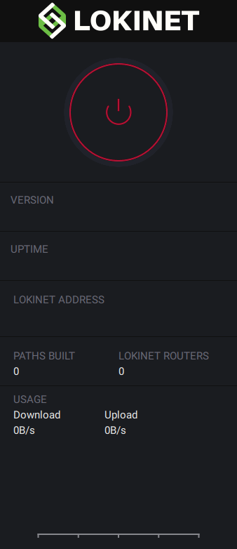
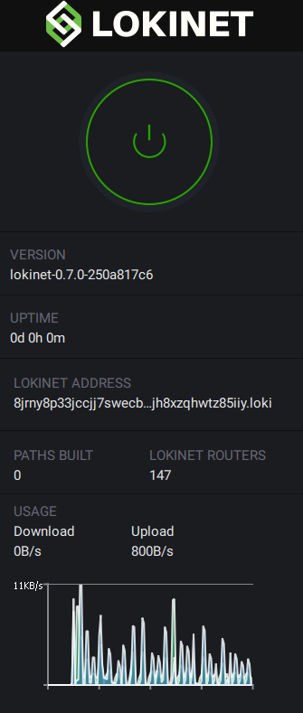

title: Loki Documentation | How to access hidden services or Lokinet SNApps using the GUI.
description: The function of SNApps is similar to so-called hidden services in Tor which have flourished. They provide users with a way to interact fully within the onion router environment, providing an even higher-degree of anonymity than can be achieved when accessing externally hosted content.

# Lokinet GUI guide

The function of [SNApps](../SNApps.md) is similar to so-called hidden services in Tor which have flourished. They provide users with a way to interact fully within the onion router environment, providing an even higher-degree of anonymity than can be achieved when accessing externally hosted content. SNApps allow for users to setup and host marketplaces, forums, whistle-blowing websites, social media, and most other internet applications on their own machines or servers while maintaining full-server and user-side anonymity. This greatly expands the scope of the network and allows users to build meaningful communities within [Lokinet](../../LokinetOverview/).

## 1. Installing

Got to the Lokinet github and download the latest release for your operating system:[https://github.com/loki-project/loki-network/releases](https://github.com/loki-project/loki-network/releases).

Alternatively you can download it through the below redirects:

- [Windows](https://loki.network/lokinetWindows/)
- [Linux](https://loki.network/lokinetLinux/)

Once downloaded, run through the installation and launch Lokinet.

## 2. Starting Lokinet Gui
Once Lokinet has been installed you will need to turn the daemon on. 

We can do this by clicking the red power button on the application.

To confirm we are connected to Lokinet all we have to see is the green power button.

## 3. Browse Lokinet - Stay Private
Jump onto a browser such as brave or firefox and try and go to the following SNApp:

- Lokinet Wiki [http://dw68y1xhptqbhcm5s8aaaip6dbopykagig5q5u1za4c7pzxto77y.loki/wiki/](http://dw68y1xhptqbhcm5s8aaaip6dbopykagig5q5u1za4c7pzxto77y.loki/wiki/)

The Lokinet Wiki has a list of other SNApp links you can go to.

Congratulations, you now have access to the Lokinet.