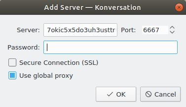
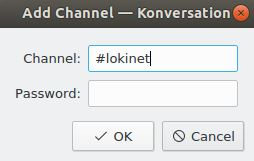
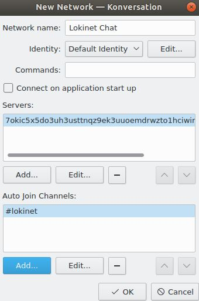
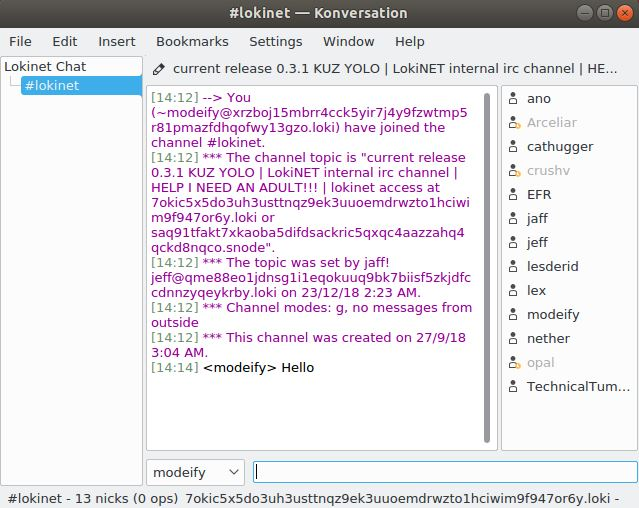

# Hosting a SNApp
## 1. Downloading an IRC client

For this guide, we will be downloading and using the `konversation` IRC client.

Go into `Ubuntu Software` application and search for `konversation`.

Once found click the `install` button.

Once Konversation has been downloaded and installed you can then launch the software.

> **Note:** You must be running `lokinet` to be able to access any IRC chats hosted on the Lokinet.
> If you do not have `lokinet` running, check out the installation guide [here](AccessingSNApps.md).

## 2. Connecting to a Lokinet IRC

On first startup of Konversation a window will pop up with the heading `Server List`.

From this window, we will click the `New...` button.

Next to `Network name:` add the text `Lokinet Chat`.

#### 2.1 Server details
In this window, underneath the `Servers:` section click the `Add...` button.

Copy and paste the following loki address into servers: `icxqqcpd3sfkjbqifn53h7rmusqa1fyxwqyfrrcgkd37xcikwa7y.loki`

Leave `Port:` as `6667` and `Password:` blank.

This window should look similar to the below before clicking the `OK` button.

#### 2.2 Channel details
Next we will add the details of the lokinet channel to automatically join the chat when accessing the server.

Click the `Add...` button underneith the `Auto Join Channels:` section.

In the `Channel:` section add the text `#lokinet` and click the `OK` button.

--- 

Once all the server and channel details have been entered your window should look like the following:

Lets click the `OK` button.

The `Server List` window will reappear, make sure the server we added is highlighted and click the `Connect` button.

Congratulations, at this point you should be connected and have joined a channel hosted on the Lokinet. 

## Finish

Well done, you have finished the guide. Jump back into the [Lokinet Public Testing Guide here](../PublicTestingGuide/#4-hosting-a-snapp).
