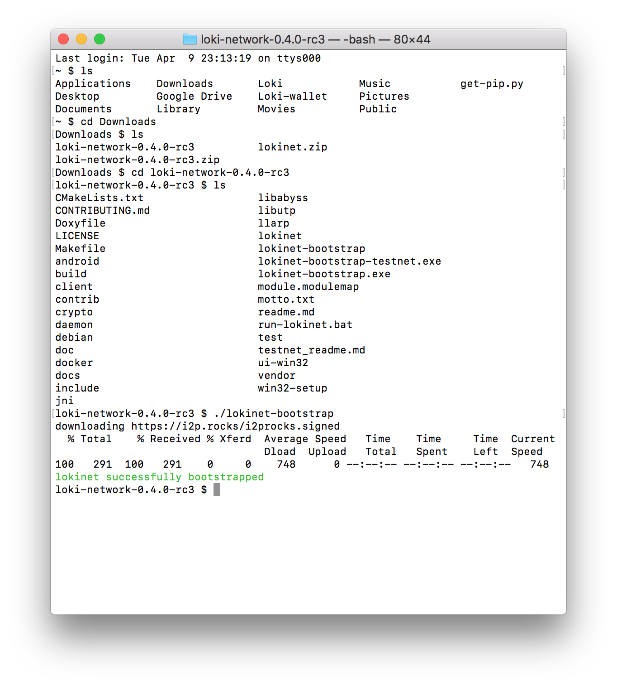

# Lokinet install guide - MacOS 

#### 1. Download the latest release

Head to [Github](https://github.com/loki-project/loki-network/releases), download the latest MacOS Lokinet release and unzip it. 

#### 2. Open terminal

Open the terminal and change directory to where your download is located.

#### 3. Run the Lokinet bootstrap

Type `./lokinet-bootstrap` into the terminal to run the Lokinet bootstrap.

#### 4. Generate configuration file

Enter `./lokinet -g` into the terminal to generate the configuration file.

#### 5. Run the Lokinet MacOS Binary

Finally you're going to run Lokinet. To do that enter `sudo ./lokinet` into the terminal.

#### 6. Done!

You should now be connected!