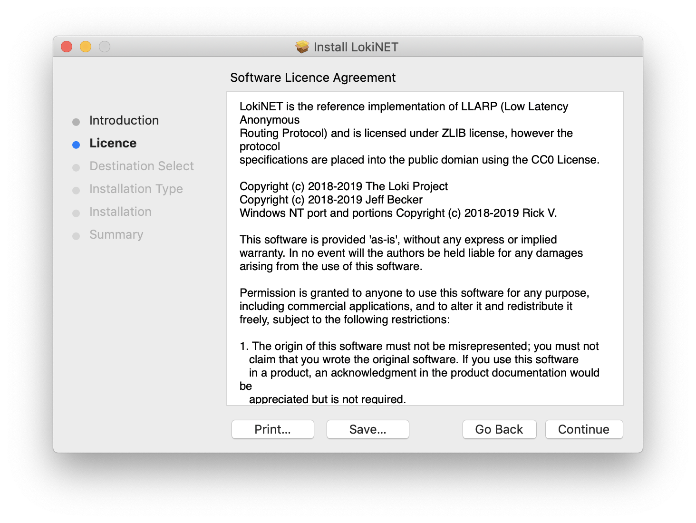
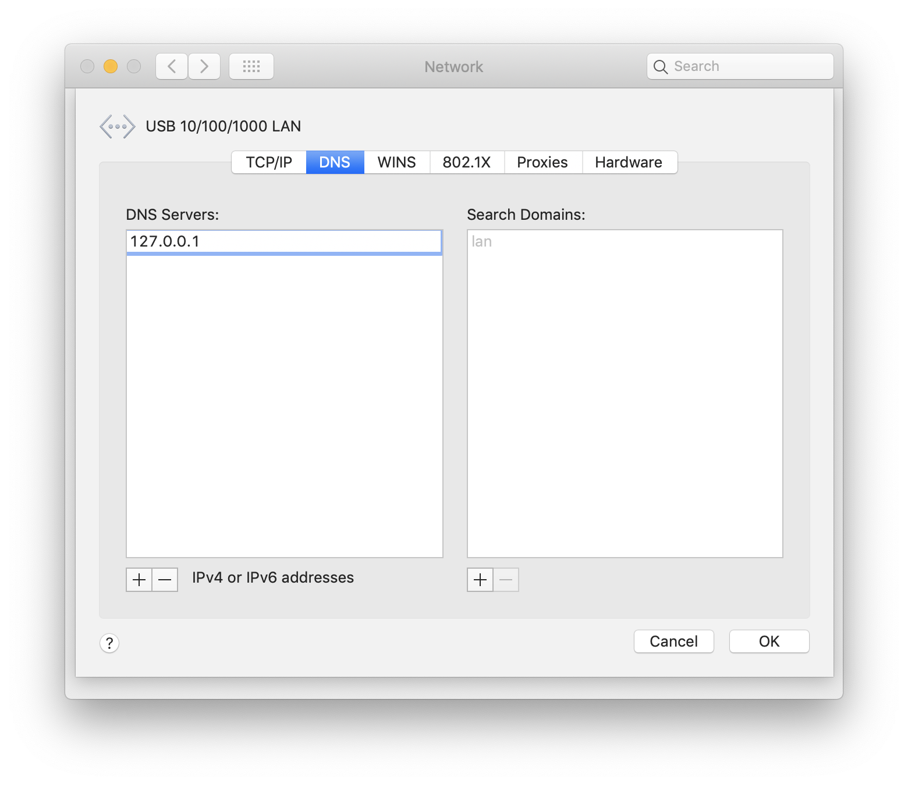

title: Loki Documentation | Lokinet MacOS Install Guide | Onion Routing
description: This guide walks you through the steps to get Lokinet, a new onion router with sybil resistance properties, working on MacOS.

# Lokinet install guide - MacOS 

## 1. Download the latest release

Head to [lokinet.org](https://lokinet.org/), download the latest MacOS Lokinet release and run it. 

## 2. Install lokinet software



## 2. Open the terminal and run the Lokinet MacOS Binary

You now want to run lokinet in your terminal:

```console
sudo ./lokinet
```


## 3. Configure DNS

If DNS is not configured automatically, you can do it manually. 
Go to `System Preferences -> Network -> Advanced -> DNS`

Click on `+` in DNS servers list. Enter `127.0.0.1` as a DNS address:



## 7. Done!

You should now be connected. Enter a .loki address into a browser and enjoy navigating lokinet!


