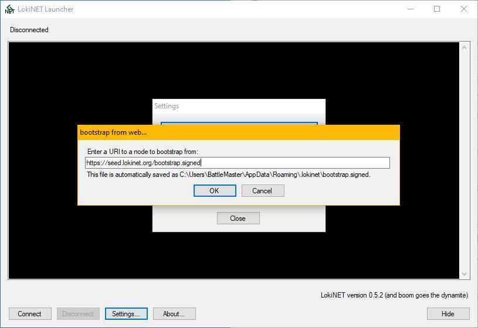

title: Loki Documentation | Lokinet Windows Install Guide | Onion Routing
description: This guide walks you through the steps to get Lokinet, a new onion router with sybil resistance properties, working on Windows.

# Lokinet install guide - Windows 10

## 1. Download the latest Lokinet Windows Installer

Head to [lokinet.org](https://lokinet.org/), download the latest Windows Lokinet. 

## 2. Run the installer

Run Lokinet-win32.exe installer and allow permission as prompted. Please make note to set an exclusion or turn off Windows Defender/ Antivirus for this step.


## 3. Click install

After reading through the dialogue boxes, hit install.


## 4. Click 'Finish' and start the launcher 


## 5. Hit the 'connect' button on the LokiNet Launcher 


## 6. You're done!

You should now be connected. 


---

## Troubleshooting

### Re-bootstrap

If you are getting a bootstrap error code then go into `Settings` > `Bootstrap Client from Web...` > and then paste in the following url:

```
https://seed.lokinet.org/bootstrap.signed
```



Click `OK` and then reconnect to Lokinet.