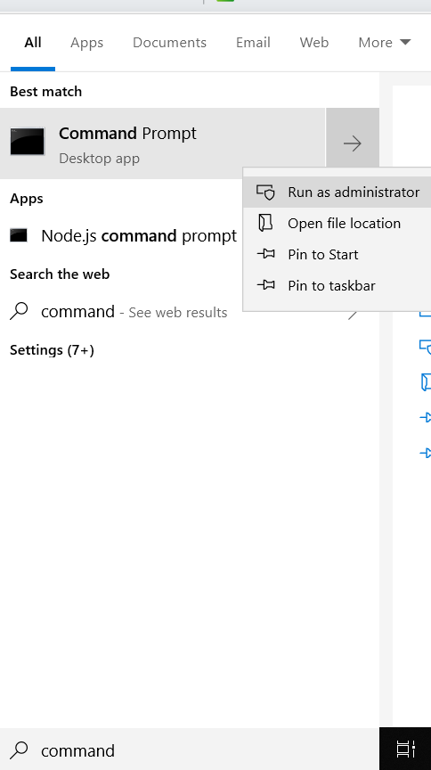
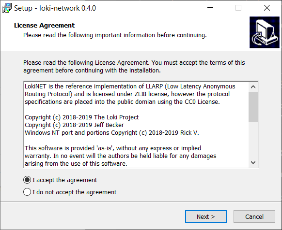
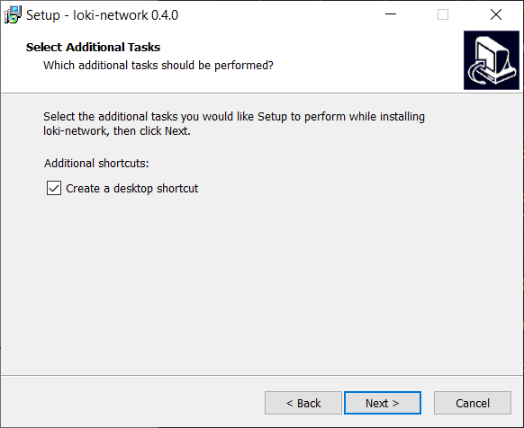
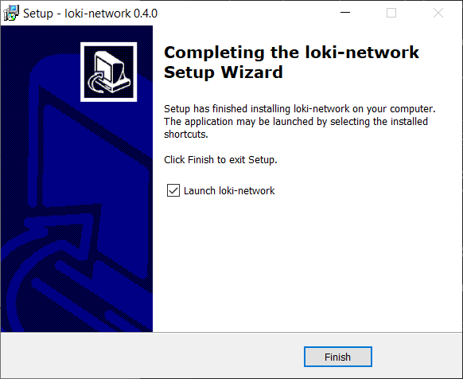
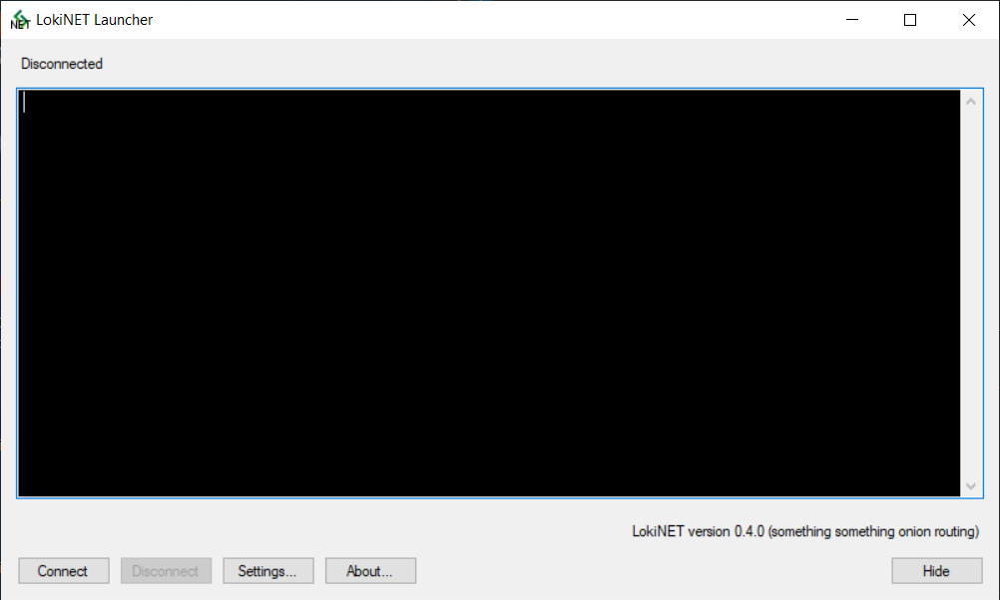
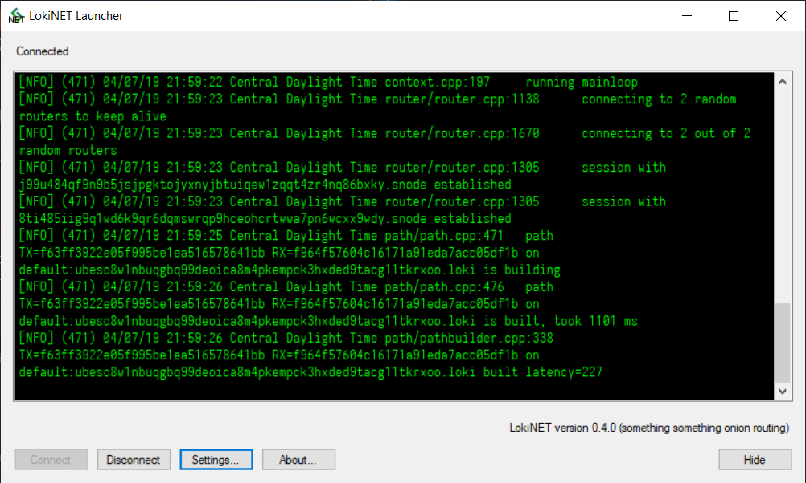

# LokiNET install guide - Windows 10

####1) Set up non-admin user

Open command prompt as an administrator (right click run as admin).

`net user <username> <password> /add`

Replacing <username> with a log-in name and <password> with a log-in password.

Now switch to your newly created account.

#### 2) Download the latest Lokinet Windows Installer

You can find the latest release of Lokinet on our Github [here.](https://github.com/loki-project/loki-network/releases)

#### 3) Run the installer

Run Lokinet-win32.exe installe and allow permission as prompted. Please make note to set an exclusion or turn off Windows Defender/ Antivirus for this step.

#### 4) Click install

After reading through the dialogue boxes, hit install.

#### 5) Click 'Finish' and start the launcher 

#### 6) Hit the 'connect' button on the LokiNet Launcher 

#### 7) You're done!

You should now be connected. 

