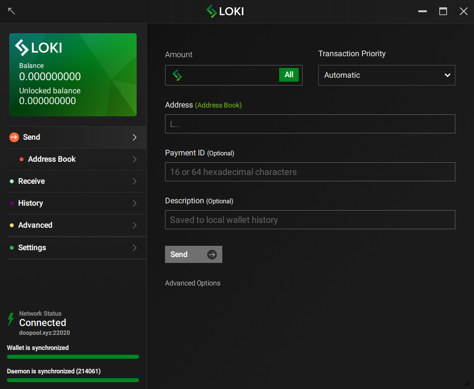
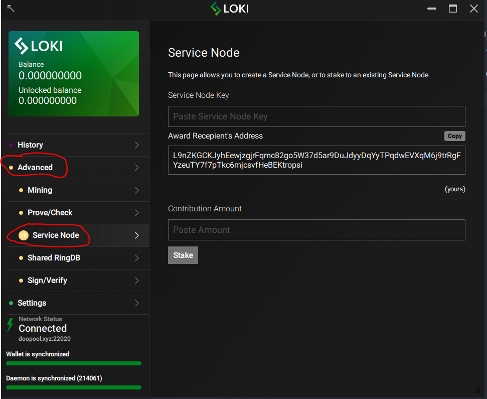

# GUI-Pool-Staking-Guide

This document will tell you exactly how to stake via the Loki GUI wallet.

The latest version of the wallet can be downloaded [here](https://github.com/loki-project/loki-gui/releases).

Please keep in mind, one can **only stake via an open pool with the GUI wallet**. If you would like to stake your own node or a create pool, please view the full guide on service nodes [here](../SNFullGuide).

 Also, this best done with a primary wallet address that is **not receiving mining transactions**. A separate primary wallet for Staking is recommended.

1) Open the wallet, enter your password, and let it fully sync to the latest blockheight.

2) Click on the **advanced** and then on the **service node** tab.

3) On this step you will need to enter the service node public key obtained from the node operator or [LokiBlocks](https://lokiblocks.com/service_nodes), your primary wallet address to receive awards, and the amount of Loki you are contributing to the node.

4) Once that is filled out, simply hit the `stake` button.

>(Please note, if you receive an error at this step, you will likely need to use the [Loki CLI](https://github.com/loki-project/loki/releases) to run `sweep_all(YOUR ADDRESS)` to fix this or simply use a separate GUI wallet primary address)

5) Congratulations, you are now staking!

6) If you have questions or need help with this guide feel free to reach out to us on [Discord](https://discordapp.com/invite/67GXfD6) or [Telegram](https://t.me/LokiCommunity).
