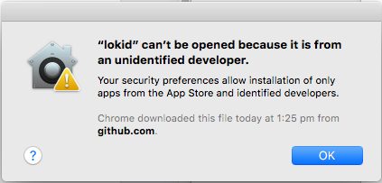
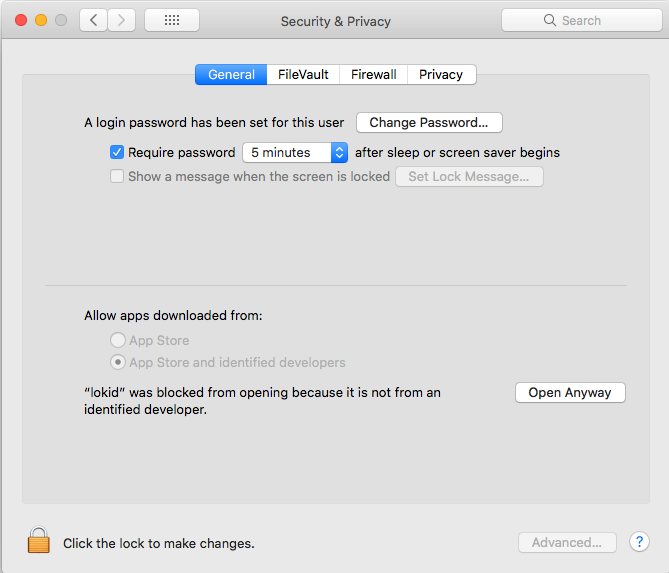

title: Loki Documentation | Loki CLI Mac Setup Guide
description: The loki-wallet-cli is the “Command Line Interface” wallet software that is used to run Loki accounts through command prompt or terminal.

# loki-wallet-cli Mac Setup

The `loki-wallet-cli` is the “Command Line Interface” wallet software that is used to run Loki accounts through command prompt or terminal. The CLI wallet only uses text to do operations, where the `oki-wallet-gui` wallet offers a graphical user interface with buttons to do most of the operations the `loki-wallet-cli` does.

If you are new to console or terminal commands and/or would prefer a wallet with buttons and Loki branding we would suggest you download the latest `loki-wallet-gui` release from [here](https://github.com/loki-project/loki-gui/releases) and follow the guide found [here](https://loki.network/wp-content/uploads/2018/05/GUI-GUIDE-WINDOWS-PDF.pdf) to get started.

Bear in mind that the CLI wallet, while harder to use, is generally faster and more reliable. If you are still interested in the 'Loki-wallet-cli' you can find it [here](https://github.com/loki-project/loki/releases). Download the latest release for your specified Operating System, for this user guide we are going to assume you are running the latest MAC OS and have XCode installed.

## Step 1: Opening loki-wallet-cli and lokid.

To use the `loki-wallet-cli` we must first have the daemon, `lokid`, up and running. The `lokid` is your node which the `loki-wallet-cli` broadcasts through. Without the node running the `loki-wallet-cli` will not be able to operate.

Open up the `lokid` file in the folder you extracted the release from. In most cases you will have the following security dialog box pop up.

<center></center>

If the dialog box opens up you will need to allow the `lokid` to open by moving your cursor to the top-left of your screen, clicking the apple logo, and then clicking on system preferences.

<center></center>

Once in system preferences click on the `Security & Privacy` button, check in this new screen that the `lokid` file was blocked, if it was you should be confident to click “Open Anyway”.

<center></center>

Keep clicking `open` and `allow` to give the software permission to run.

<center></center>

Once the software has permission a terminal window should pop up and say the following text:

  
```
**********************************************************************

The daemon will start synchronizing with the network. This may take a long time to complete.

You can set the level of process detailization through "set_log <level|categories>" command,

where <level> is between 0 (no details) and 4 (very verbose), or custom category based levels (eg, *:WARNING).

Use the "help" command to see the list of available commands.

Use "help <command>" to see a command's documentation.

**********************************************************************
```

Let the daemon run until the node is completely synced, you will know the node is synced once the terminal outputs the following text:

```
**********************************************************************

You are now synchronized with the network. You may now start loki-wallet-cli.

Use the "help" command to see the list of available commands.

**********************************************************************
```

Now the daemon is synced we can run the `loki-wallet-cli` file.

## Step 2: Setting up your loki-wallet-cli account.

If this is your first time opening the `loki-wallet-cli` it will request for you to specify a wallet name. For the purposes of this user guide we will use the example name `MyWallet`
```
Specify wallet file name (e.g., MyWallet). If the wallet doesn't exist, it will be created.

Wallet file name (or Ctrl-C to quit): MyWallet
```

Because this is the first time we have used the name `MyWallet` the following text will appear in our terminal. Type in `Y` or `Yes` to confirm your wallet name.

```
No wallet found with that name. Confirm creation of new wallet named: MyWallet

(Y/Yes/N/No): Yes
```

The `loki-wallet-cli` has now generated us a wallet called `MyWallet` and is now prompting us for a password for our generated wallet.

>Please note:
>
>- When typing the password, the characters will not appear. It will seem as if you are typing and no text is appearing however the terminal is logging every character your clicking including if it is capitalised or lowercase.
>
>- Write down your wallet name and password on a piece of paper as this information will be required every time we want to enter our wallet.
>
>- Use a password with uppercase letters, lowercase letters, numbers, symbols and make the password at least 9 characters long.

```
Generating new wallet...

Enter a new password for the wallet:

Confirm password:
```

Now once we have chosen our password for the wallet we must choose our language. For the purposes of this user guide I suggest you use English by typing `1` and clicking enter.

```
List of available languages for your wallet's seed:

If your display freezes, exit blind with ^C, then run again with --use-english-language-names

0 : Deutsch

1 : English

2 : Español

3 : Français

4 : Italiano

5 : Nederlands

6 : Português

7 : русский язык

8 : 日本語

9 : 简体中文 (中国)

10 : Esperanto

11 : Lojban

Enter the number corresponding to the language of your choice: 1
```

The `loki-wallet-cli` will generate and spit out several lines of text. Some of the information that was outputted will only ever show once, therefore it is very important to do this next section properly otherwise we may lose access to our account, thus losing access to our funds.

Let’s take a close look at each section of the newly generated wallet:

<center></center>

The text after `Generated new wallet` shows your public address. This address can be shared and will be used to receive Loki to your wallet. All Loki public addresses start with an `L....` and are followed with a string of characters. The public address shown will be your primary address however multiple public addresses can be generated from this primary address.

You do not need to write down the public address, the command `address` will re-display it whenever required.

```
Generated new wallet: LAXk6eS3Ng98QxDTdC47eNdfCXttJycKraXxfsw9cMVngGUqP3kiSE6cwXoApU6gjzSXVX1ASAPAi1MSXA935XUs1MWEcv9
```

The View key address is not to be shared unless you want to show the transactions received to the public address connected to this wallet. You do not need to write down the view key as it can be re-displayed with the command `viewkey`.

```
View key: 97d3c27e20818e5e23a6548458b50d4f128a2709c55eb7f9518d0e957a5d2e0d
```

The next few lines of text show how to navigate the `loki-wallet-client`.

```
This user guide will look into more detail the commands that can be used within the loki-wallet-client further in the guide.

Your wallet has been generated!

To start synchronizing with the daemon, use the "refresh" command.

Use the "help" command to see the list of available commands.

Use "help <command>" to see a command's documentation.

Always use the "exit" command when closing loki-wallet-cli to save

your current session's state. Otherwise, you might need to synchronize

your wallet again (your wallet keys are NOT at risk in any case).
```

The next section with the random 25 words is your mnemonic seed. The seed is used to easily back-up and restore your wallet without needing any other information. At this stage, grab a pen and paper and write down your 25 words in order(having these words out of order will not restore your wallet) and store the piece of paper in a safe and secure place. If your words are stored in a text file on your computer or stored online, you increase your risk of someone else getting control of your account.

```
NOTE: the following 25 words can be used to recover access to your wallet. Write them down and store them somewhere safe and secure. Please do not store them in your email or on file storage services outside of your immediate control.

ponies innocent oyster whale autumn knapsack jostle elapse

inroads joining doorway ticket drying obnoxious algebra tutor

biplane sack alpine zinger huge duets refer rigid inroads
```

The last of the outputs are the account balance, because your wallet does not have any Loki in it currently the balance is showing 0.

Once we receive a transaction of Loki into our wallet the balance will appear as soon as the transaction is confirmed in one block (usually less than 2 minutes). Once the transaction has been confirmed over 10 blocks the balance will show in unlocked balance.

The unlocked balance is the Loki available to be spent/sent to other addresses.

```
Starting refresh...

Refresh done, blocks received: 0

Untagged accounts:

Account Balance Unlocked balance Label

* 0 LAXk6e 0.000000000 0.000000000 Primary account

----------------------------------------------------------------------------------

Total 0.000000000 0.000000000

Currently selected account: [0] Primary account

Tag: (No tag assigned)

Balance: 0.000000000, unlocked balance: 0.000000000

Background refresh thread started”
```