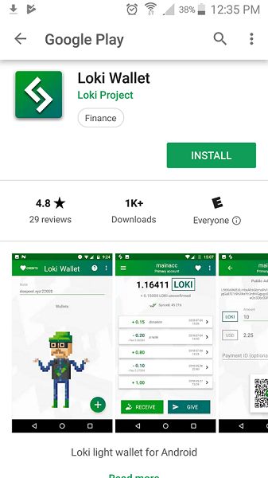
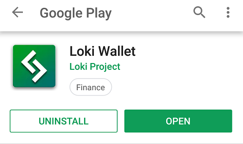
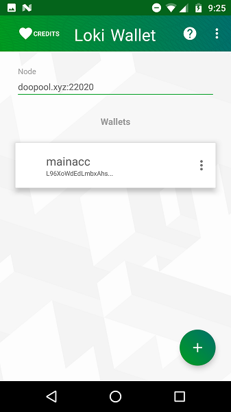
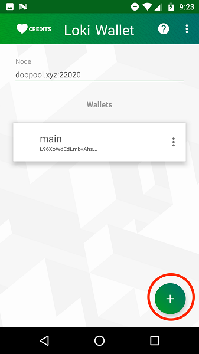

title: Loki Documentation | Loki Mobile Wallet Guide
description: This document will tell you exactly how to set up and operate the Loki Mobile wallet. Step by step guide for mobile wallet setup.

## Restoring Your Loki Mobile Wallet (Android)
<ol>
<li> Go to the Google Play Store and make sure you are signed in to your Google account.</li>

<li> Search for the app [Loki Wallet](https://play.google.com/store/apps/details?id=network.loki.wallet) and install it.</li>

<li> Open the app. Select one of the preset remote nodes. You can keep it to its default, `doopool.xyz:22020`.</li>

<li> Click the green plus button on the lower right corner to restore your wallet.</li>

<li> Restore your wallet using your private keys or using the 25 word seed.</li>

<li> When restoring using private keys, you will be asked to enter the Wallet Name, Wallet Paraphrase, Public Address, View Key, Spend Key and Restore Height or Date.</li>

<li> Set the Restore Height (a block number) or Date to a time **before** your wallet was created. Please do not enter the current block number or date.</li>

<li> Once you have entered all the information and made sure everything is correct, click `Make me a Wallet Already`.</li>
</ol>