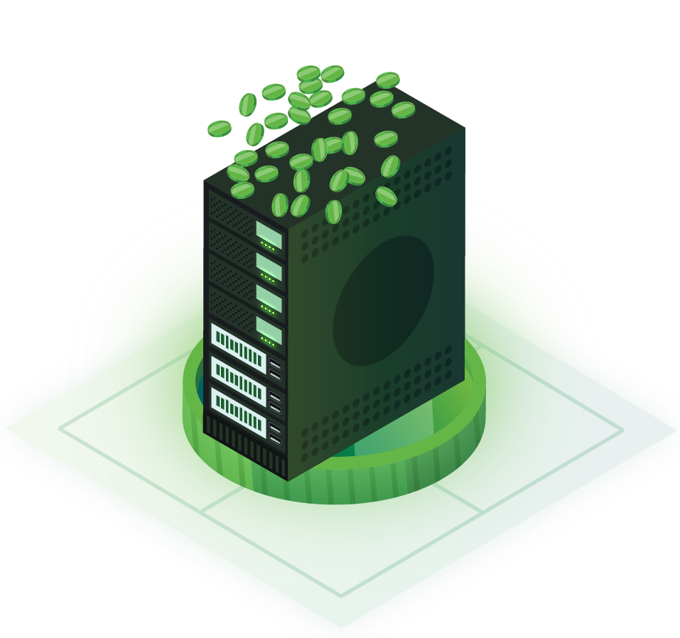

title: Loki Documentation | The Loki Network Documentation Website
description: Head to the Loki Documentation Website if you want to learn more about the privacy tools that Loki offer. Find out more information on the Loki Messenger, Loki Service Nodes, Loki Mining, Loki Onion Routing, Loki Staking Requirement and more.

# Loki Network

## Quick Navigation

|                              **About**                             	|                                                                                            **Wallets**                                                                                           	|                                           **Mining**                                           	|                                  **Service Nodes**                                 	|                                 **Lokinet**                                 	|
|:------------------------------------------------------------------:	|:------------------------------------------------------------------------------------------------------------------------------------------------------------------------------------------------:	|:----------------------------------------------------------------------------------------------:	|:----------------------------------------------------------------------------------:	|:---------------------------------------------------------------------------:	|
|                                 	|                                                                                                                                                       	|                                                         	|                                          	|                                     	|
|               [About Loki](Introduction/LokiNetwork)               	|                                                                      [What wallet should you use?](Wallets/WalletsOverview)                                                                      	|                              [Mining Loki](Mining/MiningOverview)                              	|                      [Service Nodes](ServiceNodes/SNOverview)                      	|                      [Lokinet](Lokinet/LokinetOverview)                     	|
| See more information on the different aspects of the Loki Network. 	| Learn more about which wallet best suits you and see the guides to help you set one up. 	| You can mine Loki using your CPU.  Learn more about mining and see step by step guides. 	| Learn more about Service Nodes and see step by step guides to help you set one up. 	| Learn more about the Lokinet and follow step by step guides to gain access. 	|

## Information is Important

<iframe width="560" height="315" src="https://www.youtube.com/embed/Lykh-NqkKys" frameborder="0" allow="autoplay; encrypted-media" allowfullscreen></iframe>

Privacy is having the agency to decide when you reveal personal information. It is a particularly valuable quality today, when the collection and storage of personal data is taking place at unprecedented levels in history.

Loki provides the means to transact and communicate privately and anonymously, using the decentralised nature of blockchain technology to create new methods of interacting with the internet.

Loki is a privacy cryptocurrency based on Monero. Loki currently offers an incentivised full node layer and over the coming months we look to support a secondary p2p network that offers private communications based on the Signal protocol.

More information on the project can be found on the [website](https://www.loki.network) and in the [whitepaper](https://loki.network/wp-content/uploads/2018/10/LokiWhitepaperV3_1.pdf).

Loki is an open source project, and we encourage contributions from anyone with something to offer. For more information on contributing, please contact team@loki.network

If you are unsure where to start check out our "Getting Started" page by [clicking here](Introduction/GettingStarted.md)

Otherwise to begin browsing Loki Docs [click here](Introduction/LokiNetwork.md).

## Community Channels

- Telegram: [t.me/LokiCommunity](https://t.me/LokiCommunity)
- GitHub: [https://github.com/loki-project/loki](https://github.com/loki-project/loki)
- Discord: [https://discord.gg/67GXfD6](https://discord.gg/67GXfD6)
- Twitter: [https://twitter.com/loki_project](https://twitter.com/loki_project)
- Youtube: [https://www.youtube.com/lokinetwork](https://www.youtube.com/lokinetwork)
- Reddit: [https://www.reddit.com/r/LokiProject/](https://www.reddit.com/r/LokiProject/)
- Mail: [team@loki.network](mailto:team@loki.network)

## Copyright

Copyright (c) 2018 The Loki Project.   
Portions Copyright (c) 2014-2018 The Monero Project.   
Portions Copyright (c) 2012-2013 The Cryptonote developers.
